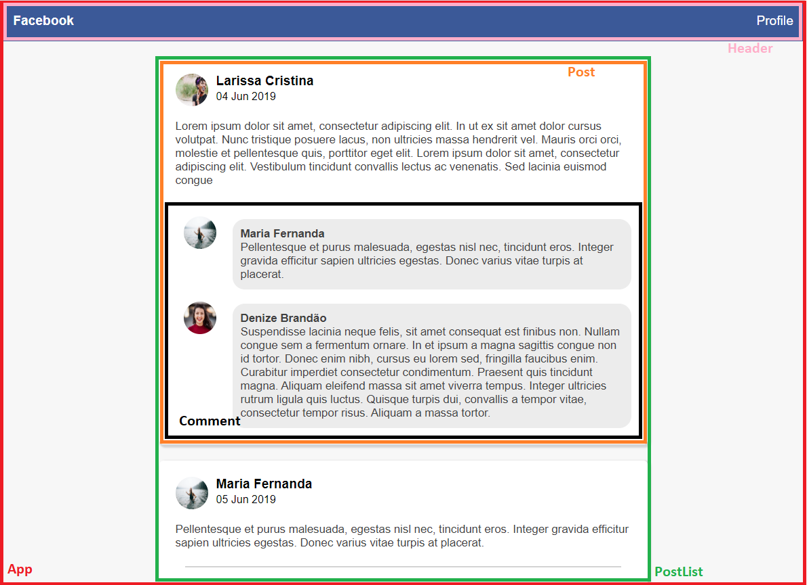

# Facebook-like Layout

---
#### A simple interface to practice ReactJS skills.

- App
    - Header
    - PostList
        - Post
            - Comments

Here is an image from project, highlighting components used in this implementation:

---

#### Try it for yourself

clone the project and run using Yarn:

Download all dependencies: 
> yarn 

Run the project
> yarn dev 

or NPM

Download all dependencies
> npm install

Run the project

>npm run dev

---

Francisco Silva / francisco.prosilva@gmail.com 
